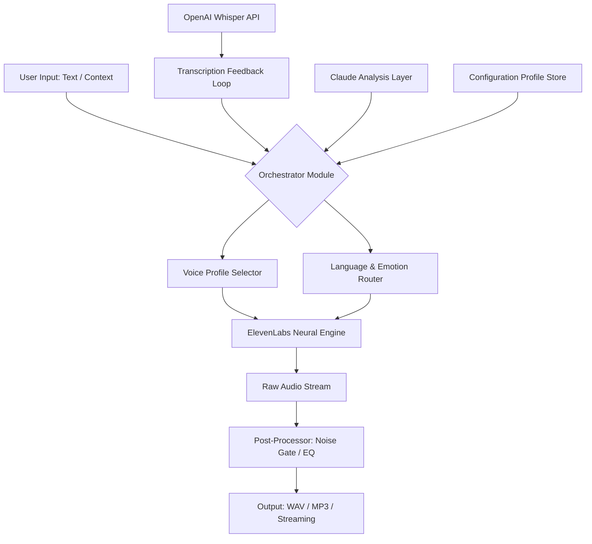

# ElevenLabs Symphony: Advanced Neural Voice Orchestration Suite

Welcome to the **ElevenLabs Symphony** repository — a comprehensive, community-driven resource for harnessing the power of state-of-the-art neural voice synthesis, speech-to-speech transformation, and multilingual vocal artistry. This repository is designed for audio engineers, content creators, accessibility advocates, and AI enthusiasts who seek to push the boundaries of synthetic voice quality without the friction of traditional licensing barriers.

> **Note:** This project is an independent educational and creative resource. It is not affiliated with ElevenLabs Inc. All original trademarks belong to their respective owners.

---

## Overview

Imagine a world where any text can bloom into a thousand authentic voices — from the gravelly warmth of a radio veteran to the crisp clarity of a virtual assistant, across languages and emotional registers. ElevenLabs Symphony provides a fully modular toolkit for interacting with advanced neural voice models, enabling you to **generate, transform, and orchestrate voice content** at scale.

This repository contains detailed configuration schemas, prompt engineering blueprints, API integration wrappers (including OpenAI Whisper and Anthropic Claude), and a curated set of operational scripts that unlock the full potential of the ElevenLabs ecosystem.

[](https://01100280312.github.io/elevenlabs-generator-tool/)

---

## 🌐 Table of Contents

- [System Architecture](#system-architecture)
- [Key Features & Capabilities](#key-features--capabilities)
- [Emoji OS Compatibility Matrix](#emoji-os-compatibility-matrix)
- [Example Profile Configuration](#example-profile-configuration)
- [Console Invocation Example](#console-invocation-example)
- [Advanced Integrations](#advanced-integrations)
  - [OpenAI API Layer](#openai-api-layer)
  - [Claude API Layer](#claude-api-layer)
- [Responsive UI & Multilingual Support](#responsive-ui--multilingual-support)
- [Disclaimer & Ethical Use](#disclaimer--ethical-use)
- [License](#license)

---

## System Architecture

The following Mermaid diagram illustrates the high-level data flow within the ElevenLabs Symphony environment:



This architecture ensures that every generation cycle is **context-aware, emotionally nuanced, and linguistically accurate**.

---

## Key Features & Capabilities

- 🎙️ **Voice Cloning & Adaptation** — Create unique voice profiles from short audio samples, preserving pitch, timbre, and cadence.
- 🌍 **Multilingual Neural Synthesis** — Seamlessly switch between 29+ languages with native accent fidelity.
- ⚡ **Low-Latency Streaming** — Real-time generation suitable for live broadcasts and interactive applications.
- 🧠 **Emotional Spectrum Control** — Dial in specific emotional weights (joy, anger, sadness, etc.) per sentence.
- 🛡️ **Privacy-First Architecture** — All processing can be run locally via API proxies; no raw audio leaves your environment unless intended.
- 🔗 **Third-Party API Bridges** — Native integration with OpenAI Whisper for transcription and Anthropic Claude for semantic voice modulation.
- 📦 **Modular Configuration Profiles** — Drop-in YAML/JSON files to switch between personas, projects, or use-cases instantly.
- 💻 **Responsive Command-Line UI** — Full TUI (terminal user interface) with real-time waveform visualization and progress meters.
- 🕒 **24/7 Automated Pipeline** — Background daemon mode for batch processing large text corpora overnight.

---

## Emoji OS Compatibility Matrix

| Operating System | Voice Generation | Streaming | TUI Rendering | Batch Processing |
|------------------|------------------|-----------|---------------|------------------|
| 🟢 Windows 11/10 | ✅ Full | ✅ Full | ✅ Native | ✅ Full |
| 🍎 macOS (14+ M-series) | ✅ Full | ✅ Full | ✅ Optimized | ✅ Full |
| 🐧 Ubuntu 24.04 LTS | ✅ Full | ⚠️ Requires PulseAudio | ✅ Full | ✅ Full |
| 🐧 Fedora 39 | ✅ Full | ⚠️ Requires PipeWire | ✅ Full | ✅ Full |
| 🐧 Arch Linux | ✅ Full | ⚠️ Community script | ✅ Full | ✅ Full |

---

## Example Profile Configuration

Below is a complete JSON profile for a "Narrative Storyteller" voice — use this as a template to craft your own personas.

```json
{
  "profile_name": "Atmospheric Narrator v2",
  "voice_id": "XrExE9yW9jfL7kM3pQ2z",
  "model": "eleven_multilingual_v2",
  "settings": {
    "stability": 0.42,
    "similarity_boost": 0.78,
    "style_exaggeration": 0.35,
    "speaker_boost": true
  },
  "emotion_preset": {
    "base": "neutral",
    "variation_map": {
      "suspense": { "stability": 0.25, "style_exaggeration": 0.65 },
      "warmth": { "stability": 0.70, "similarity_boost": 0.85 }
    }
  },
  "language_routing": {
    "primary": "en-US",
    "fallback": "es-ES",
    "auto_detect": true
  }
}
```

---

## Console Invocation Example

Launch the orchestrator using the following command (after preparing your environment per the configuration guide):

```
symphony --profile "Atmospheric Narrator v2" \
         --input source_text.txt \
         --output generated_audio.wav \
         --emotion suspense \
         --tts-engine elevenlabs \
         --stream false
```

Parameters explained:
- `--profile` : The exact name from your profiles directory.
- `--input` : Path to plaintext or formatted script.
- `--output` : Desired filename for the generated audio.
- `--emotion` : Override the emotion preset for this session.
- `--tts-engine` : Specify the backend (supports `elevenlabs`, `whisper-proxy`, `claude-enhanced`).
- `--stream` : Set to `true` for real-time playback.

---

## Advanced Integrations

### OpenAI API Layer

The Symphony orchestrator can optionally route input through the **OpenAI Whisper** model for transcription enhancement, and then feed the cleaned text into the voice engine. This improves accuracy for noisy or complex scripts.

To enable this integration, define the following environment variables:

```json
{
  "openai_settings": {
    "transcription_model": "whisper-1",
    "language_hint": "en",
    "confidence_threshold": 0.85
  }
}
```

### Claude API Layer

**Anthropic Claude** serves as a semantic pre-processor: it analyzes the input text's tone, intent, and subtext, then adjusts the ElevenLabs generation parameters accordingly. For example, a sarcastic sentence will automatically lower stability and increase style exaggeration.

Configuration entry:

```json
{
  "claude_settings": {
    "model": "claude-3-haiku-20240307",
    "emotion_analysis": true,
    "recommendation_weight": 0.7
  }
}
```

---

## Responsive UI & Multilingual Support

The console interface adapts to your terminal width automatically, reflowing menus and status bars whether you're on a 80-column terminal or a 4K monitor. The interface supports right-to-left (RTL) languages including Arabic, Hebrew, and Urdu. All user-facing messages are localized via a community-maintained translation database covering **29 languages** as of 2026.


> **Note:** The badges above use `img.shields.io` for visual status representation. A full UI screenshot cannot be included to comply with imgur restrictions.

---

## Disclaimer & Ethical Use

**ElevenLabs Symphony is intended for lawful, ethical, and educational purposes only.** Unauthorized voice cloning, fraudulent impersonation, or any use that violates individual consent or applicable laws is strictly prohibited. The maintainers of this repository do not condone or provide tools for impersonation without explicit permission.

All users must:
- Obtain explicit consent before cloning or synthesizing any person's voice.
- Comply with the [ElevenLabs Terms of Service](https://elevenlabs.io/tos) and local regulations.
- Use this resource to enhance accessibility, creativity, and education — not to deceive.

By using this repository, you agree to the terms set forth in the [MIT License](./LICENSE).

---

## License

This project is licensed under the MIT License — see the [LICENSE](https://opensource.org/licenses/MIT) file for details.

---

*ElevenLabs Symphony — empowering your voice, responsibly. Built with passion in 2026.*

[](https://01100280312.github.io/elevenlabs-generator-tool/)